# دليل استخدام لوحة التحكم (Admin Panel)

يعطيك العافية! هاد الدليل رح يشرحلك كيف تستخدم لوحة التحكم للمشروع تبعك خطوة بخطوة، باللهجة الأردنية البسيطة عشان تكون الأمور واضحة وسهلة.

---

## 1. تسجيل الدخول (Login)

رابط المشروع: [http://166.1.227.210:3000/](http://166.1.227.210:3000/)

**بيانات الدخول:**
- **الإيميل (Email):** `admin@admin.com`
- **الباسورد (Password):** `admin@123`

أول ما تفتح الموقع، رح تطلعلك شاشة تسجيل الدخول. عشان تفوت عالسيستم:
1. دخل الإيميل تبعك في خانة **Email Address**.
2. دخل الباسورد في خانة **Password**.
3. اكبس على زر **Sign In**.

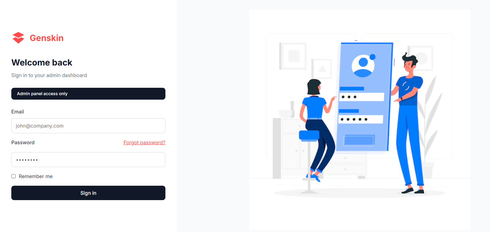

---

## 2. الشاشة الرئيسية (Dashboard)

بس تفوت، رح تلاقي بوجهك الشاشة الرئيسية (Dashboard). هاي الشاشة بتعطيك الزبدة عن شغلك:
- **Revenue**: قديش مطلع مصاري إجمالي.
- **Orders**: كم طلب وصلك لحد الآن.
- **Customers**: عدد الزبائن المسجلين عندك.
- **Avg Order Value**: متوسط قيمة الطلب الواحد.

وكمان بتشوف جدول بآخر 5 طلبات وصلتك عشان تضل متابع أول بأول.

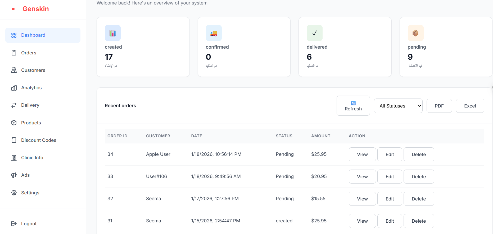

---

## 3. التحليلات (Analytics)

صفحة **Analytics** بتعطيك نظرة أعمق على أداء مشروعك:
- **Sales Trend**: رسم بياني بوضحلك كيف المبيعات طالعة أو نازلة مع الوقت.
- **Orders by Status**: مخطط دائري بفرجيك توزيع الطلبات حسب حالتها (واصل، ملغي، قيد الانتظار).
- وإحصائيات عامة زي المبيعات الكلية وعدد الزبائن.

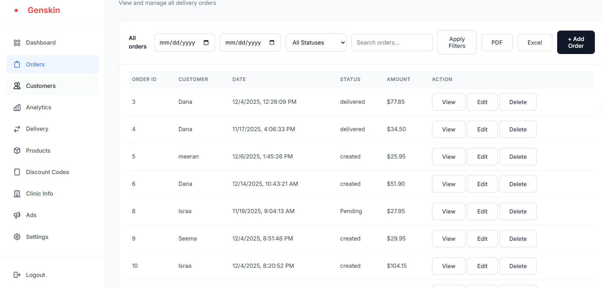

---

## 4. إدارة الطلبات (Orders)

من القائمة اللي عالجنب، اكبس على **Orders**. هون بتلاقي كل الطلبات اللي انعملت عالموقع.

### كيف تتصرف مع الطلبات:
- **الفلترة**: بتقدر تفرز الطلبات حسب التاريخ (من - إلى) أو حسب حالة الطلب (Pending, Delivered, etc.).
- **البحث**: في خانة بحث بتقدر تكتب فيها اسم الزبون أو رقم الطلب عشان تلاقيه بسرعة.
- **الإجراءات (Actions)**:
    - **View**: بتشوف تفاصيل الطلب كاملة (شو طلب بالزبط، عنوانه، إلخ).
    - **Edit**: إذا بدك تعدل شي عالطلب.
    - **Delete**: إذا بدك تحذف الطلب من السيستم.

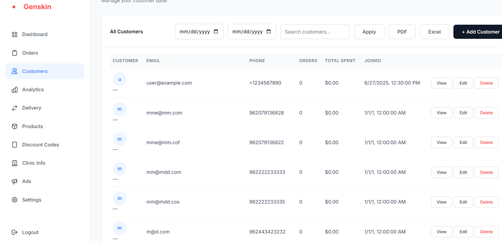

---

## 4. إدارة الزبائن (Customers)

عشان تشوف مين مسجل عندك وتدير حساباتهم، روح على **Customers** من القائمة.

### كيف تضيف زبون جديد (Add New Customer):
هاي النقطة اللي طلبتها بالزبط. عشان تضيف زبون جديد يدوياً:
1. اكبس على زر **+ Add Customer** الموجود فوق الجدول.
2. رح تطلعلك شاشة صغيرة (Modal).
3. عبي البيانات المطلوبة:
    - **Name**: اسم الزبون.
    - **Email**: إيميله.
    - **Phone**: رقم تلفونه.
4. بس تخلص، اكبس **Save Customer**.

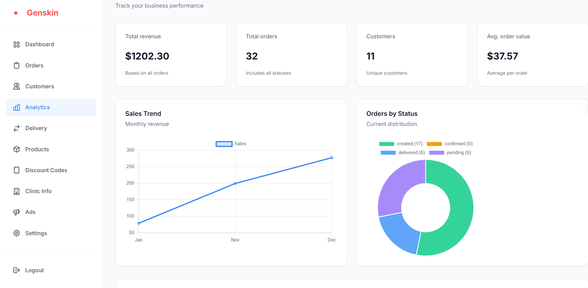

وكمان بتقدر تعدل بيانات أي زبون أو تحذفه من الأزرار اللي جمب اسمه بالجدول.

---

## 5. المنتجات (Products)

من صفحة **Products**، بتقدر تتحكم بكلشي بتبيعه.
- **إضافة منتج**: اكبس **+ Add Product**، عبي اسم المنتج، سعره، الوصف، وحط صورته، واختار الفئة (Category).
- **تعديل/حذف**: زي باقي الصفحات، بتقدر تعدل السعر أو تحذف المنتج إذا بطل متوفر.

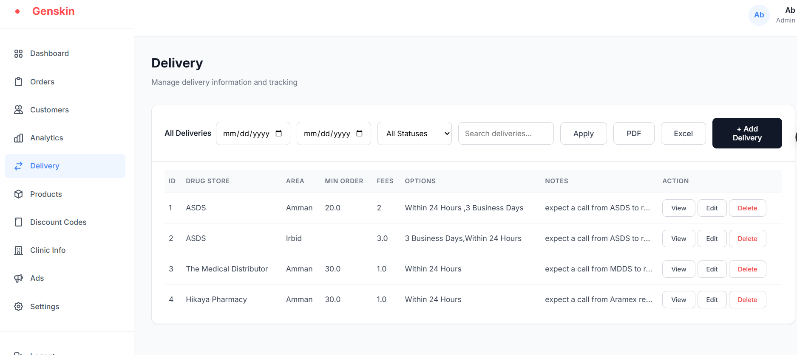

---

## 6. إعدادات التوصيل (Delivery)

بصفحة **Delivery**، بتحدد المناطق اللي بتوصل إلها وقديش رسوم التوصيل.
- بتقدر تضيف خيار توصيل جديد، تحدد المنطقة (Area)، وقديش الرسوم (Fees).
- هاد الحكي بساعدك لما الزبون يطلب، يعرف قديش رح يدفع توصيل.

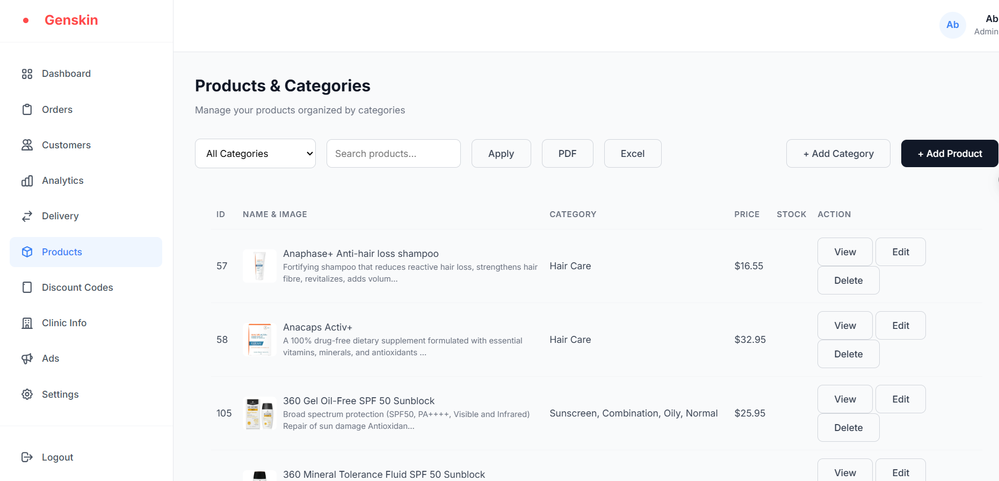

---

## 7. الخصومات (Discounts)

بدك تعمل عروض؟ روح على **Discounts**.
- اكبس **+ Add Discount Code**.
- اكتب الكود (مثلاً: `RAMADAN2025`).
- حدد نسبة الخصم (مثلاً 10%) أو مبلغ ثابت.
- حدد تاريخ انتهاء الخصم عشان يوقف لحاله.

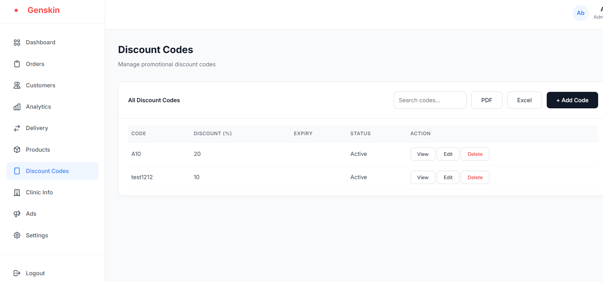

---

## 9. الإعلانات (Ads)

هاي الصفحة عشان تحط بنرات إعلانية تطلع بالواجهة للزبائن (Ads/Banners).
- بترفع الصورة وبتحط عنوان للإعلان، وبتفعله (Active) أو بتوقفه.

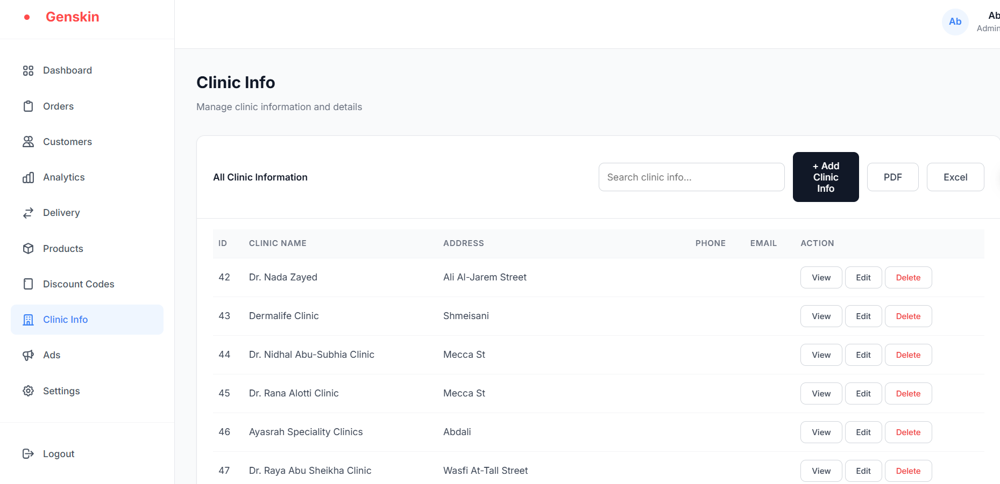

---

## 10. معلومات العيادة (Clinic Info)

آخر اشي بالقائمة **Clinic Info**. هاي الصفحة عشان تحط معلومات التواصل تبعتك:
- اسم العيادة/المتجر.
- العنوان.
- رقم التلفون.
- الإيميل.

هاي المعلومات رح تظهر للناس عشان يقدروا يتواصلوا معك.

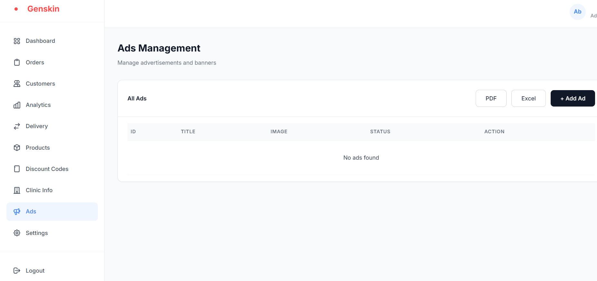

---

## 11. الإعدادات (Settings)

بصفحة **Settings**، بتقدر تغير معلومات الشركة الأساسية:
- **Company Name**: اسم الشركة.
- **Email Address**: الإيميل الرسمي.
- **Phone Number**: رقم الهاتف.
- **Business Address**: العنوان.

هاي المعلومات ممكن تنعكس بالفواتير أو بالفوتر (Footer) حسب تصميم الموقع.

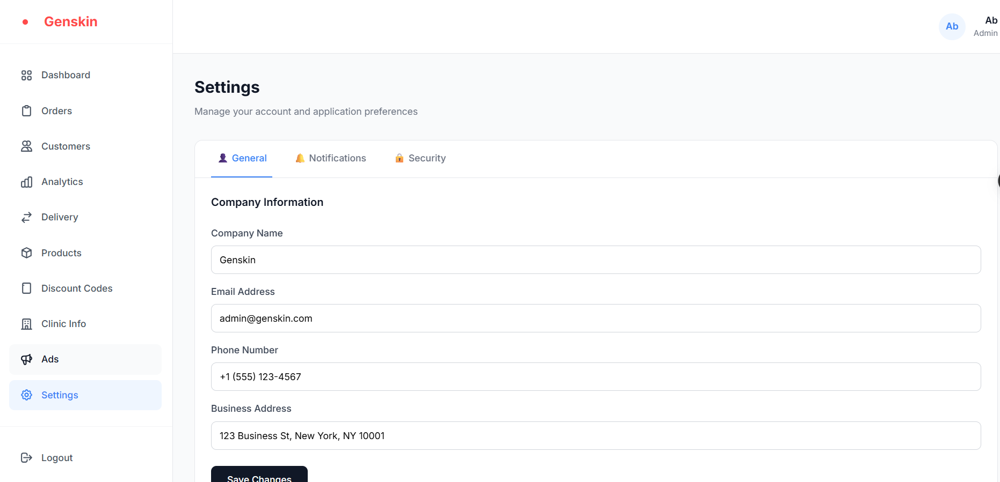

---

**خلاصة:**
الموقع مصمم يكون سهل ومباشر. القائمة اللي عاليسار هي وسيلتك لتتنقل بين كل هاي الأمور. أي تعديل بتعمله هون، بينعكس فوراً عند الزبائن.

إذا واجهت أي مشكلة أو "Error"، تذكر إنه في رسائل تنبيه بتطلعلك بالزاوية (Notifications) بتقلك شو صار (نجحت العملية أو فشلت).

بالتوفيق يا رب!
